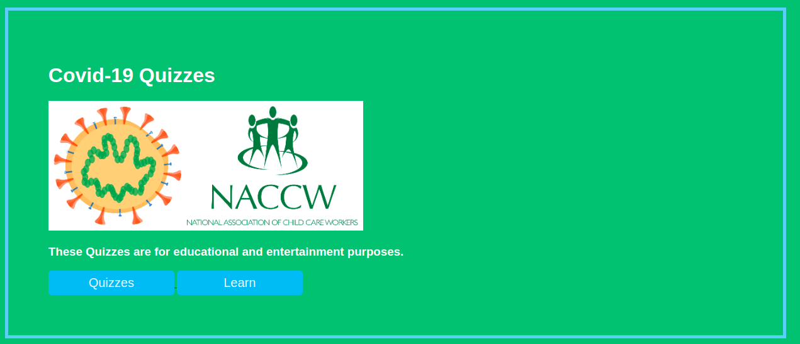

# Project Title: Covid19 Quizzes 
Quiz questions about Covid19 in South Africa. These quizzes are for learning more about the pandemic, for having fun and keeping updated about responses to Covid19 in SA.

### Preview
The quiz looks 

### Accessibility

Simply visit this [link](https://naccw.github.io/covid19Quizzes/) to start.

## Where do these quiz questions come from?

These quiz questions come from the  [COVID-19 Corona Virus South African Resource Portal](https://sacoronavirus.co.za/)

## Some conventions
Covid19 is sometimes used intercheable with Covid-19. 
Lock-down  sometimes used intercheable with  Lockdown
Minor spelling error like Inorder, instead of in order or recieve instead of receive  are likely to be found these quizzes.

## Contributing

You are welcome contribute questions or other features to be added.When contributing to this repository, please first discuss the change you wish to make via issue, email, or any other method with the owners of this repository before making a change.

## Contributor
* **Donald Nghonyama**  - *Content Supervisor* - [NACCW](http://www.naccw.org.za/about-naccw/directors-executive-committee-and-staff)
* **Nompumelelo Mtsweni** - *Developer* - [github](https://github.com/elolelo)

## Acknowledgments

* For : [National Association of Child Care Workers](http://www.naccw.org.za/)
* Virus image used is from [this research](https://www.ncbi.nlm.nih.gov/research/coronavirus/)
* Quiz layout [inspiration](https://codingartistweb.com/)

